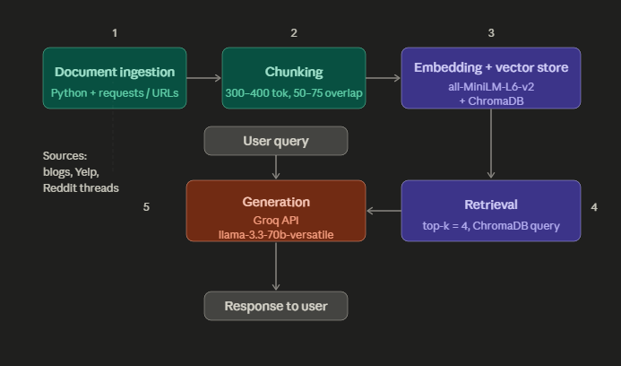

# Project 1 Planning: The Unofficial Guide

> Write this document before you write any pipeline code.
> Your spec and architecture diagram are what you'll use to direct AI tools (Claude, Copilot, etc.) to generate your implementation — the more specific they are, the more useful the generated code will be.
> Update the Retrieval Approach and Chunking Strategy sections if you change your approach during implementation.
> Update this file before starting any stretch features.

---

## Domain

<!-- What domain did you choose? Why is this knowledge valuable and hard to find through official channels? -->
Finding the best rated study spots can be difficult when the information is spread all over and no one knows if it is reliable or not. Official channels often are promoting a certain brand or company and these can be overcrowded and just no enjoyable for some students. Having one place where students can find study spots leaves more time for the actual studying. This project should combine popular study areas like coffee shops, cafes, libraries, classroom buildings, etc. and introduce users to more niche and under the ground spots.This project should also be honest and give appropriate feedback on each place according to the sources. As a student, I get sick of the same, busy places that I would love to find more intimate spots that are different than my dorm or the nearby Starbucks.
---

## Documents

<!-- List your specific sources: URLs, subreddit names, forum threads, or file descriptions.
     Aim for at least 10 sources that together cover different subtopics or perspectives within your domain. -->

---
https://sweetwatergainesville.com/resources/best-study-spots-uf/ 
https://subjectsaviors.com/the-top-10-best-study-spots-in-gainesville/
https://www.swamprentals.com/help-finding-apartments/gainesville-study-spots-near-campus
https://gatorrentals.com/blog/best-study-spots-on-campus/
https://www.staygainesville.com/uf-campus-insider-tips-best-study-spots-hidden-gems
https://spoonuniversity.com/school/ufl/uf-s-best-coffee-shops-for-study-sessions-coffee-shop-in-gainesville/
https://www.hercampus.com/school/ufl/5-gainesville-coffee-shops-to-visit-this-semester/
https://www.collegemagazine.com/top-10-local-coffee-shops-that-all-uf-students-need-to-try/
https://www.yelp.com/biz/pascals-coffeehouse-at-christian-study-center-gainesville
https://www.hercampus.com/school/ufl/gainesville-bucket-list/
https://www.reddit.com/r/ufl/comments/oqbhhq/best_unknown_study_spots_on_campus/
https://www.reddit.com/r/ufl/comments/16tqs1w/whats_your_favorite_place_to_study/
https://www.reddit.com/r/ufl/comments/j0yaz0/pretty_outdoor_study_spots_around_gainesville/
https://www.reddit.com/r/ufl/comments/xnrfer/what_are_some_good_coffee_shopsplaces_to_study/
---

## Chunking Strategy

<!-- How will you split documents into chunks?
     State your chunk size (in tokens or characters), overlap size, and explain why those
     numbers fit the structure of your documents.
     A review-heavy corpus warrants different chunking than a long FAQ. -->

**Chunk size:** 300-400 tokens

**Overlap:** 50-75 tokens

**Reasoning:** I chose these amounts because all of my sources are informal, opinion based articles - student blogs, Yelp reviews, Reddit threads. Chunking too big can lead to generalizations and multiple contradicting opinions in one section. Chunking too small can lead to cut offs mid sentence and lose the general ideas explained. For the Reddit threads, I would love to chunk by comment if I can figure it out. Each response is already a complete thought/opinion.

---

## Retrieval Approach

<!-- Which embedding model are you using (e.g., all-MiniLM-L6-v2 via sentence-transformers)?
     How many chunks will you retrieve per query (top-k)?
     If you were deploying this for real users and cost wasn't a constraint, what tradeoffs
     would you weigh in choosing a different embedding model — context length, multilingual
     support, accuracy on domain-specific text, latency? -->

**Embedding model:** all-MiniLM-L6-v2

**Top-k:** k = 4

**Production tradeoff reflection:** Because I am still learning about specific models and different LLM's, I don't know what else I would try. I think it would be cool to use ChatGPT or Gemini to see how different models differ. I know the model I chose has a token limit of 256, so I would find something that can handle longer pieces of text. Multilingual support is not really a prioirty as of right now, but would be impressive to implement. 

---

## Evaluation Plan

<!-- List your 5 test questions with their expected correct answers.
     Questions should be specific enough that you can judge whether the system's response
     is right or wrong. "What are good dining halls?" is too vague.
     "What do students say about wait times at [dining hall name] during lunch?" is testable. -->

| # | Question | Expected answer |
|---|----------|-----------------|
| 1 | | | What do students say about noise levels at Library West during finals week?
Expected answer: It gets very crowded and loud during finals, hard to find a seat. It is better to go early or find an alternative like Norman or Smathers during that period.
| 2 | | |  Is Pascal's Coffeehouse open late enough for a night study session?
Expected answer: No — Pascal's closes at 5pm weekdays and 3pm Saturday, so it's not a good late-night option despite its great atmosphere.
| 3 | | | What makes Newell Hall different from Library West as a study spot?
Expected answer: Newell has more variety. It includes study stairs with outlets, isolated pods, and whiteboards. It also has a more social/collaborative feel compared to Library West's quiet cram atmosphere.
| 4 | | | Do students recommend Opus Coffee at the Norman Hall location over other Opus locations?
Expected answer: Yes because it's on the quieter outer edge of campus and is near sorority row, for those involved in Greek life. .
| 5 | | | What are the downsides students mention about studying at Plaza of the Americas?
Expected answer: It's weather-dependent. Great in cooler months, but gets extremely hot in Florida summer, making it uncomfortable for outdoor studying.

---

## Anticipated Challenges

<!-- What could go wrong? Name at least two specific risks with reasoning.
     Consider: noisy or inconsistent documents, missing source attribution, off-topic
     retrieval, chunks that split key information across boundaries. -->

1.Contradicting opinions -> Two different sources could say two different things, especially when you are taking real perspectives into account. Everyone's opinion is different and I am not sure how the LLM is going to choose between them.

2.Not having an answer -> I am uploading 10-12 sources/URLs, so it is possible that my bot might not be able to answer some questions it is asked if it has never heard about a specific place. If it is not in the sources, the bot will not know it. I don't want it to make up answers either. It needs to be based off of real opinions or tell the user that it does not know. 

---

## Architecture

<!-- Draw a diagram of your pipeline showing the five stages:
     Document Ingestion → Chunking → Embedding + Vector Store → Retrieval → Generation
     Label each stage with the tool or library you're using.
     You can use ASCII art, a Mermaid diagram, or embed a sketch as an image.
     You'll use this diagram as context when prompting AI tools to implement each stage. -->

--- 

## AI Tool Plan

<!-- For each part of the pipeline below, describe:
     - Which AI tool you plan to use (Claude, Copilot, ChatGPT, etc.)
     - What you'll give it as input (which sections of this planning.md, which requirements)
     - What you expect it to produce
     - How you'll verify the output matches your spec

     "I'll use AI to help me code" is not a plan.
     "I'll give Claude my Chunking Strategy section and ask it to implement chunk_text()
     with my specified chunk size and overlap" is a plan. -->

**Milestone 3 — Ingestion and chunking:** 
Using Claude, I will paste my sources and my chunking strategy. I expect a working ingest.py with a load_documents() function and a chunk_text() function that splits the text by token count and overlap count. It should attach the place name, source, and type to each chunk. I will verify by printing the first three chunks and check its token length and overlap. 

**Milestone 4 — Embedding and retrieval:**
Using Claude, I will paste my chunked text in the output format and my five test questions. I expect that it initializes ChromaDB and embeds chunks in complete sentences and a retrieve() function that returns the top chunks, according to its metadata. I will verify by running my five test questions and manually check that the information is relevant to the question being asked.

**Milestone 5 — Generation and interface:**
Using Claude, I will paste my entire retrieve() function, API set up, and a sample of what a retrieved chunk looks like and ask Claude to turn all of this into a system prompt. I expect a working working loop: the user types a question, top four chunks are retrieved, put into a prompt, and Groq returns the answer with references. I will verify this with my five test questions and compare these responses to my actualy answers.